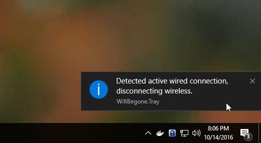

# WifiBegone

Sure, there's ways to prioritize connections, but they don't always work (think HyperV virtual switches). WifiBegone disconnects from WiFi when wired in, reconnects when not - simple!

[Download Latest Release](https://github.com/Silvenga/WifiBegone/releases/)

## How does it work?

When WifiBegone detects a wireless and wired (active) connection, it will attempt to disconnect from the wireless using the native WiFi interface found in Windows. 

To detect active interfaces WifiBegone does the following:

- Finds all wireless and wired "Up" interfaces installed. VPN's and other known tunnels are ignored. 
- For each interface, bind a TCP client.
- Attempt to connect to either 8.8.8.8 or 2001:4860:4860::8888 (Google's public DNS server) on port 53 (default port for DNS). 
- If success, mark connection as active

When a network change from wired to no-network is detected, WifiBegone will attempt to connect to the strongest WiFi connection where a valid wireless profile exists. 

## TODO

- [X] Handle IPv6 only connections
- [X] Testing
- [X] Installer
- [X] Custom Icon
- [X] Detect network changes, don't poll
- [ ] Possible issue with wifi-direct connections
- [ ] Possible crash during startup